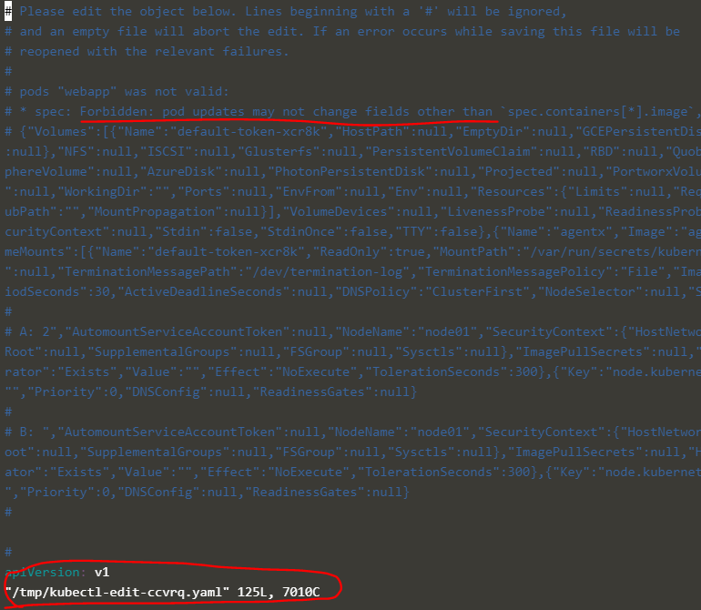
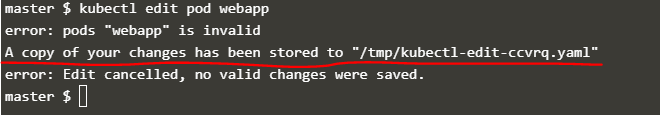

# A quick note on editing Pods and Deployments

## Editing Pods
Remember, you CANNOT edit specifications of an existing POD other than the below.
- `spec.containers[*].image`
- `spec.initContainers[*].image`
- `spec.activeDeadlineSeconds`
- `spec.tolerations`

For example you cannot edit the environment variables, service accounts, resource limits (all of which we will discuss later) of a running pod. But if you really want to, you have 2 options:
1. Run `kubectl edit pod <pod_name>` command.  This will open the pod specification in an editor (vi editor). Then edit the required properties. When you try to save it, you will be denied. This is because you are attempting to edit a field on the pod that is not editable.



You can then delete the existing pod by running the command:
```bash
kubectl delete pod <pod_name>
```
Then create a new pod with your changes using the temporary file
```bash
kubectl create -f /tmp/kubectl-edit-ccvrq.yaml
```

2. The second option is to extract the pod definition in YAML format to a file using the command
```bash
kubectl get pod <pod_name> -o yaml > my-new-pod.yaml
```
Then make the changes to the exported file using an editor (vi editor). Save the changes

```bash
vi my-new-pod.yaml
```
Then delete the existing pod and create a new pod using the edited file
```bash
kubectl delete pod <pod_name>
```
Then create a new pod with the edited file
```bash
kubectl create -f my-new-pod.yaml
```

## Editing Deployments
With Deployments you can easily edit any field/property of the POD template. Since the pod template is a child of the deployment specification, with every change the deployment will automatically delete and create a new pod with the new changes. So if you are asked to edit a property of a POD part of a deployment you may do that simply by running the command

```bash
kubectl edit deployment <deployment_name>
```